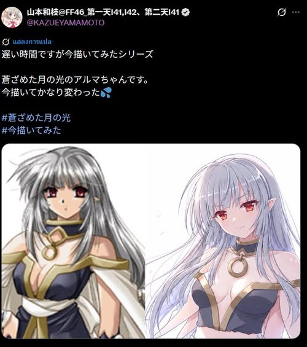

# Alma กับความงามของตัวละครคนละยุค

> [น่าสนใจดีก็เลยเอามาเล่าไปเรื่อย]

ช่วงนี้อาจารย์ **山本和枝** เอาตัวละครเก่า ๆ มาลองวาดใหม่ และครั้งนี้ก็เป็นภาพของ **Alma** จากเกม **蒼ざめた月の光** ในสไตล์ปัจจุบัน

หลายคนสังเกตว่าภาพใหม่ดูนุ่มขึ้น อ่อนโยนขึ้น และให้ความรู้สึกเป็นงานยุคใหม่มากกว่าเดิม

ตัวอาจารย์เองก็พูดประมาณว่า

> "สมัยก่อนยังวาดโครงร่างร่างกายไม่เก่ง เลยทำให้ชุดต่างไปนิดหน่อย"

แต่หลังจากนั้นก็มีแฟนรุ่นเก่าออกมาอธิบายว่า ชุดเดิมอาจไม่ได้เป็นเพียงผลจากข้อจำกัดด้าน anatomy อย่างที่หลายคนเข้าใจ

เพราะดีไซน์ดั้งเดิมตั้งใจให้ผ้าคาดอยู่ใต้หน้าอก คล้ายชุดมิโกะ ยูกาตะ หรือฮันบก มากกว่าจะเป็นผ้าคาดเอวธรรมดา

เรื่องเล็ก ๆ นี้กลับพาไปสู่ประเด็นที่น่าสนใจกว่ามาก

---

## ดีไซน์ที่ไม่ได้มีแค่คำว่า "วาดผิด"

สิ่งที่น่าสนใจไม่ใช่ว่าชุดเดิมถูกหรือผิด

แต่คือมันสะท้อนให้เห็นความแตกต่างของ **วิธีคิดในการออกแบบตัวละคร** ของแต่ละยุค

นักวาดสาย bishoujo และ fantasy ในยุค 90s-2000s หลายคนไม่ได้ให้ความสำคัญกับ anatomy ในระดับเดียวกับปัจจุบัน

สิ่งที่พวกเขาให้ความสำคัญมากกว่าคือ

> "ทำอย่างไรให้คนเห็นเพียงครั้งเดียวแล้วจำตัวละครได้"

หรือสิ่งที่ปัจจุบันเรียกว่า **Silhouette Design**

ด้วยเหตุนี้ ตัวละครในยุคนั้นจึงมักมี

* ทรงผมขนาดใหญ่
* เครื่องประดับที่โดดเด่น
* เสื้อผ้าที่มีรูปทรงเฉพาะตัว
* การใช้สีที่ตัดกันชัดเจน
* ท่วงท่าที่ดูมีพลัง

บางอย่างอาจดูไม่สมจริงนักหากพิจารณาตามหลักร่างกาย

แต่กลับทำให้ตัวละครมีเอกลักษณ์และจดจำได้ง่ายอย่างน่าประหลาด

นักวาดยุคนั้นจำนวนมากมีความสามารถสูงในการสร้าง "ตัวตน" ให้กับตัวละคร

จนบางครั้งเพียงเห็นเงา สีผม หรือโทนสีโดยรวม ผู้ชมก็สามารถบอกได้ทันทีว่าเป็นใคร

แม้เวลาจะผ่านไปหลายสิบปีแล้วก็ตาม

---

## Alma เวอร์ชันใหม่

ในอีกด้านหนึ่ง Alma เวอร์ชันปัจจุบันก็สะท้อนแนวทางของงานยุคใหม่ได้อย่างชัดเจน

* เส้นดูนุ่มขึ้น
* สีผิวสว่างและใสขึ้น
* แสงเงาละมุนขึ้น
* สีตาดูอ่อนโยนขึ้น
* สีหน้าเข้าถึงง่ายขึ้น

หลายคนจึงรู้สึกว่า Alma เวอร์ชันเก่ามีบรรยากาศแบบ

> "เย็น คม และลึกลับ"

ขณะที่เวอร์ชันใหม่ให้ความรู้สึก

> "อ่อนโยน สวย และเป็นมิตร"

ความจริงแล้วไม่มีแบบใดเหนือกว่าอีกแบบหนึ่ง

เพราะทั้งสองเวอร์ชันกำลังพยายามสื่อสารความงามคนละประเภท

---

## ศิลปะไม่ได้เพิ่ม Stat แบบเกม RPG

งานเก่าถูกสร้างขึ้นในยุคที่ภาพต้องดึงดูดสายตาผู้คนจากหน้ากล่องเกม ชั้นวางสินค้า และหน้ากระดาษนิตยสาร

แต่งานสมัยใหม่เกิดขึ้นในยุคของจอความละเอียดสูง และผู้ชมที่คุ้นเคยกับงานลงสีแบบละเอียดนุ่มนวล

ดังนั้นสิ่งสำคัญจึงไม่ใช่การตัดสินว่า

> "เมื่อก่อนวาดไม่เก่ง"

หรือ

> "เดี๋ยวนี้เหนือกว่า"

แต่คือการเข้าใจว่า นักวาดแต่ละยุคกำลังแก้ปัญหาคนละแบบ

นักวาดรุ่นใหม่จำนวนมากมีพื้นฐานด้านโครงสร้างร่างกายที่แข็งแรงกว่าเดิมมาก

แต่ในบางครั้ง ตัวละครกลับมีหน้าตาและบรรยากาศคล้ายกันจนแยกออกยาก

ในขณะที่นักวาดรุ่นเก่าหลายคนอาจไม่ได้แม่น anatomy เท่าปัจจุบัน

แต่มีความสามารถสูงในการทำให้ตัวละครแต่ละคนมีเอกลักษณ์จนจดจำได้ทันที

---

## บทส่งท้าย

สุดท้ายแล้ว ศิลปะไม่ได้พัฒนาแบบเกม RPG ที่ตัวเลข Stat เพิ่มขึ้นเรื่อย ๆ

บางอย่างดีขึ้น

บางอย่างหายไป

และบางเสน่ห์ของงานยุคเก่า ต่อให้เทคนิคสมัยใหม่ก้าวหน้าเพียงใด ก็อาจไม่สามารถสร้างกลับมาได้เหมือนเดิม

บางทีสิ่งที่ทำให้เราหวนกลับไปมองภาพเก่า ๆ ซ้ำแล้วซ้ำเล่า

อาจไม่ใช่ความสมจริงของภาพ

แต่เป็นเพราะตัวละครเหล่านั้นยังคงมี "ตัวตน" อยู่ในความทรงจำของผู้คน แม้เวลาจะผ่านไปนานเพียงใดก็ตาม
